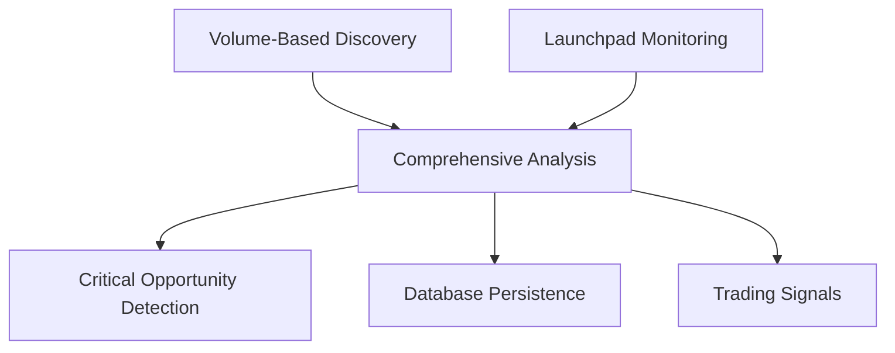

# 🚀 Launchpad Integration: Complete Coverage Strategy

## 🎯 Enhanced Data Pipeline: Volume Leaders + New Launches

Our behavioral intelligence system now provides **complete market coverage** by combining volume-based prioritization with real-time launchpad monitoring, ensuring we capture both established opportunities and emerging alpha.

## 📡 Launchpad Monitoring Coverage

### **Supported Launchpads**
| Launchpad | Focus | Whale Detection | Risk Assessment |
|-----------|-------|----------------|-----------------|
| **pump.fun** | Community meme tokens | $5k+ threshold | Medium risk (community-driven) |
| **Raydium** | DEX pool launches | $5k+ threshold | Low risk (established DEX) |
| **Meteora** | Advanced AMM tokens | $5k+ threshold | Low risk (sophisticated platform) |
| **Jupiter** | Aggregator listings | $5k+ threshold | Variable (depends on source) |

### **Detection Capabilities**
- **⏰ Real-time Launch Detection**: <4 hour scan window for new tokens
- **🐋 Early Whale Activity**: $5k+ transaction monitoring in first hours
- **📈 Holder Surge Analysis**: Growth rate tracking for new communities
- **🎯 Smart Money Entry**: Known wallet activity in new launches
- **⚠️ Rug Pull Assessment**: Multi-factor risk scoring
- **🔒 Liquidity Lock Detection**: Creator behavior analysis

## 🧠 Comprehensive Data Pipeline Architecture

### **Dual-Source Intelligence Strategy**


### **Phase 1: Parallel Discovery**
```
Volume Prioritizer    +    Launchpad Monitor
        ↓                        ↓
   Top 500 by Volume      New Launches (<24h)
        ↓                        ↓
   Established Leaders      Early Opportunities
        ↓                        ↓
        └──── Unified Analysis ────┘
```

### **Phase 2: Intelligence Fusion**
- **Behavioral Analysis**: Full Helius analysis on both established and new tokens
- **Signal Prioritization**: Combined scoring across volume and launchpad metrics
- **Risk Assessment**: Enhanced evaluation for new tokens
- **Critical Alerts**: Cross-category opportunity identification

## 📊 Enhanced Schema for Launchpad Data

### **New Behavioral Columns**
```sql
-- Existing behavioral columns
new_holders_24h, whale_buys_24h, volume_spike_ratio, 
token_age_hours, transaction_pattern_score, smart_money_score

-- New launchpad-specific columns  
launchpad VARCHAR(20),           -- pump.fun, raydium, meteora, etc.
launch_time TIMESTAMP,           -- Actual launch time
early_whale_signals INTEGER,     -- Count of early whale signals
holder_growth_rate DECIMAL(5,2), -- Holder growth percentage  
rug_pull_risk VARCHAR(10),       -- low, medium, high
priority_score INTEGER,          -- Combined priority scoring
source VARCHAR(15)               -- volume_based, launchpad_new, hybrid
```

## 🎯 Trading Signal Categories

### **Established Market Opportunities**
- **📈 Volume Spikes**: >2x volume increase in established tokens
- **🐋 Whale Activity**: >2 whale transactions in high-volume tokens  
- **👥 Holder Growth**: >20 new holders in established communities
- **🎯 Smart Money**: >5 smart money score in volume leaders

### **New Launch Opportunities** ⭐
- **🚀 Fresh Launches**: <24h old tokens from monitored launchpads
- **🐋 Early Whale Targets**: Whale activity in <6h old tokens
- **📈 Holder Surge**: Rapid community growth in new tokens
- **💰 Smart Money Entry**: Known wallets entering new opportunities

### **Critical Opportunities** 🚨
- **Priority Score >200**: Highest-scoring opportunities across all categories
- **Cross-validated Signals**: Tokens appearing in multiple signal types
- **Time-sensitive Alpha**: <1h old tokens with immediate whale interest

## ⚡ Natural Language Query Support

### **Launchpad-Specific Queries**
- **"Show me pump.fun tokens with whale activity in first hour"**
- **"Find new Raydium launches with growing holders"** 
- **"Tokens launched today with smart money entry"**
- **"Early whale targets under 6 hours old"**
- **"Critical opportunities from all launchpads"**

### **Cross-Category Intelligence**
- **"New tokens with established-level whale activity"**
- **"Volume spikes in tokens launched this week"**
- **"Smart money entering both new and established tokens"**
- **"Holder growth comparison: new launches vs volume leaders"**

## 🔧 Implementation Architecture

### **LaunchpadMonitor Service**
```typescript
// Real-time launchpad scanning
await monitor.scanForNewLaunches();

// Early whale activity detection  
const signals = await monitor.detectEarlyWhaleActivity();

// Monitoring statistics
const stats = monitor.getMonitoringStats();
```

### **BehavioralLaunchpadCrawler** ⭐
```typescript
// Comprehensive analysis (volume + launchpad)
const signals = await crawler.runComprehensiveCrawl(20, 15);

// Quick opportunity scan
const quickScan = await crawler.runQuickLaunchpadScan();

// Deep alpha analysis
const deepAnalysis = await crawler.runDeepOpportunityAnalysis();
```

## 📈 Production Deployment Modes

### **Quick Scan Mode** (Frequent Monitoring)
- **Volume Tokens**: 10 highest-volume tokens
- **Launchpad Tokens**: 10 newest launches with signals
- **Analysis Depth**: Essential behavioral metrics
- **Runtime**: ~1-2 minutes
- **Frequency**: Every 15 minutes

### **Standard Mode** (Regular Analysis)
- **Volume Tokens**: 20 volume-prioritized tokens
- **Launchpad Tokens**: 15 launch opportunities  
- **Analysis Depth**: Full behavioral intelligence
- **Runtime**: ~3-5 minutes
- **Frequency**: Every 30 minutes

### **Deep Analysis Mode** (Comprehensive Research)
- **Volume Tokens**: 30 top volume tokens
- **Launchpad Tokens**: 20 new launches with full analysis
- **Analysis Depth**: Complete pattern recognition + risk assessment
- **Runtime**: ~8-12 minutes  
- **Frequency**: Every 2 hours

## 🎯 Trader Alpha Advantages

### **Early Detection Edge**
- **First-mover Advantage**: Detect whale interest before mass adoption
- **Time-sensitive Alerts**: <1h old tokens with immediate activity
- **Cross-launchpad Coverage**: No opportunities missed across platforms

### **Risk-Adjusted Opportunities**
- **Rug Pull Assessment**: Multi-factor risk scoring for new launches
- **Creator Analysis**: Wallet behavior patterns for launch teams
- **Liquidity Validation**: Lock status and depth analysis

### **Complete Market Vision**
- **Established + Emerging**: Both volume leaders and new opportunities
- **Priority Scoring**: Unified ranking across all token types  
- **Signal Correlation**: Cross-validation between categories

## 💰 Cost Optimization Strategy

### **Smart API Usage**
- **Free Discovery**: Jupiter provides 1,497 verified tokens at no cost
- **Selective Deep Analysis**: Helius used on high-priority tokens only
- **Launchpad Focus**: Monitor new tokens where whale activity is most meaningful
- **Batch Processing**: Efficient parallel analysis

### **ROI Maximization**
- **High Signal-to-Noise**: Focus on tokens with real trading potential
- **Early Alpha Capture**: Maximum value from first-mover opportunities
- **Risk Management**: Avoid analysis on obvious scams or dead tokens

## 🚀 Complete Coverage Achievement

The enhanced pipeline now provides **total Solana token market coverage**:

✅ **Established Leaders**: Top 500 tokens by volume with behavioral analysis
✅ **New Opportunities**: Real-time launchpad monitoring with early signals  
✅ **Whale Intelligence**: Both established whale activity and early whale detection
✅ **Risk Assessment**: Enhanced evaluation for new vs established tokens
✅ **Critical Alerts**: Cross-category opportunity identification
✅ **Natural Language**: Complete query support across all categories

This comprehensive approach ensures traders have access to both proven opportunities (high-volume behavioral signals) and emerging alpha (new launch early detection), providing maximum coverage of profitable trading opportunities in the Solana ecosystem.